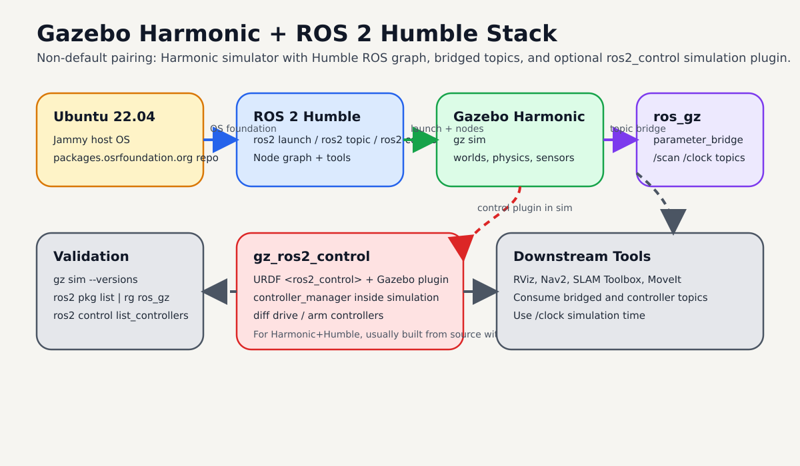
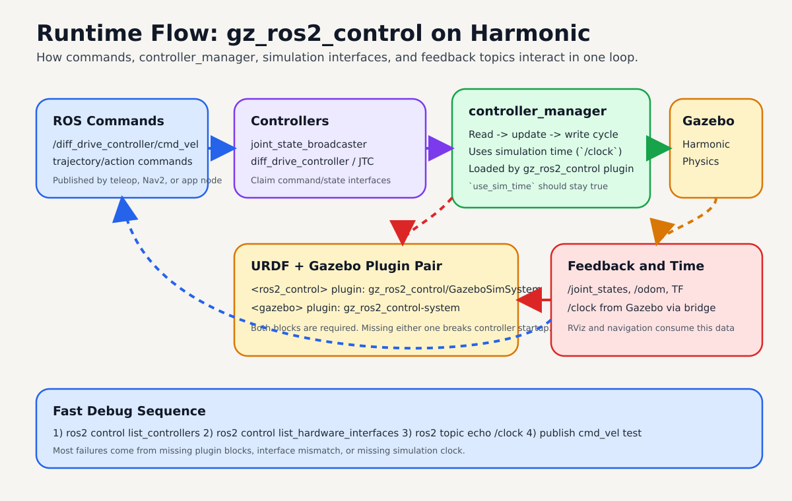

# Gazebo Sim Harmonic with ROS 2 Humble

Use this page to run Gazebo Sim Harmonic on Ubuntu 22.04 with ROS 2 Humble.

By the end, you should be able to launch Gazebo from ROS 2, bridge key topics, and validate simulation time correctly.

{ width="1100" }

High-level map of the full setup: OS, ROS graph, Gazebo simulator, bridge layer, and optional `gz_ros2_control`.

## Quick Start

Install Harmonic and ROS integration:

```bash
sudo apt-get update
sudo apt-get install curl lsb-release gnupg

sudo curl https://packages.osrfoundation.org/gazebo.gpg \
  --output /usr/share/keyrings/pkgs-osrf-archive-keyring.gpg

echo "deb [arch=$(dpkg --print-architecture) signed-by=/usr/share/keyrings/pkgs-osrf-archive-keyring.gpg] \
https://packages.osrfoundation.org/gazebo/ubuntu-stable $(lsb_release -cs) main" \
| sudo tee /etc/apt/sources.list.d/gazebo-stable.list > /dev/null

sudo apt-get update
sudo apt-get install gz-harmonic ros-humble-ros-gzharmonic
```

Launch Gazebo from ROS 2:

```bash
source /opt/ros/humble/setup.bash
ros2 launch ros_gz_sim gz_sim.launch.py gz_args:=empty.sdf
```

Expected result:

- Gazebo opens with `empty.sdf`
- `ros2 pkg list | rg ros_gz` shows bridge/sim packages
- `/clock` is available once bridged

!!! warning
    `Harmonic + Humble` is a non-default pairing. Official Humble default is Gazebo Fortress. Use this setup only when you explicitly need Harmonic.

## Prerequisites

| Item | Requirement |
| --- | --- |
| OS | Ubuntu 22.04 (Jammy) |
| ROS | ROS 2 Humble installed and sourceable |
| Shell | `bash` with `sudo` access |
| GPU | Optional, but helpful for GUI performance |

## Compatibility Notes

From Gazebo official compatibility guidance:

- ROS 2 Humble + Gazebo Harmonic is possible (`use with caution`)
- ROS 2 Humble default pairing remains Gazebo Fortress
- Non-default Harmonic packages can conflict with `ros-humble-ros-gz*`

If you previously installed default Humble Gazebo packages, check for conflicts before installing Harmonic-specific ones.

```bash
dpkg -l | rg "ros-humble-ros-gz|ros-humble-ros-gzharmonic|gz-harmonic"
```

## Install Steps

{ width="1100" }

Use this order to avoid missing rosdep keys and package-mix conflicts.

### 1) Add Gazebo package repository

```bash
sudo apt-get update
sudo apt-get install curl lsb-release gnupg
sudo curl https://packages.osrfoundation.org/gazebo.gpg \
  --output /usr/share/keyrings/pkgs-osrf-archive-keyring.gpg
echo "deb [arch=$(dpkg --print-architecture) signed-by=/usr/share/keyrings/pkgs-osrf-archive-keyring.gpg] \
https://packages.osrfoundation.org/gazebo/ubuntu-stable $(lsb_release -cs) main" \
| sudo tee /etc/apt/sources.list.d/gazebo-stable.list > /dev/null
sudo apt-get update
```

### 2) Install Harmonic and ROS bridge packages

```bash
sudo apt-get install gz-harmonic ros-humble-ros-gzharmonic
```

Expected result:

- `gz sim --versions` shows Harmonic
- ROS packages for `ros_gz` are available on Humble

## Add ros2_control for Gazebo (Harmonic + Humble)

For Humble default Gazebo (Fortress), `gz_ros2_control` can be installed from apt.
For `Harmonic + Humble`, use the source build flow from official `gz_ros2_control` docs.

{ width="1100" }

Runtime view: controllers feed command interfaces through `controller_manager`, Gazebo executes physics, and feedback returns on ROS topics with simulation time.

### 1) Install rosdep rules for Harmonic

```bash
sudo bash -c 'wget https://raw.githubusercontent.com/osrf/osrf-rosdep/master/gz/00-gazebo.list \
  -O /etc/ros/rosdep/sources.list.d/00-gazebo.list'
rosdep update
rosdep resolve gz-harmonic
```

### 2) Build `gz_ros2_control` for Harmonic

```bash
source /opt/ros/humble/setup.bash

mkdir -p ~/gz_ros2_control_ws/src
cd ~/gz_ros2_control_ws/src
git clone https://github.com/ros-controls/gz_ros2_control -b humble

export GZ_VERSION=harmonic
rosdep install -r --from-paths . --ignore-src --rosdistro humble -y \
  --skip-keys="ros_gz_bridge ros_gz_sim"

cd ~/gz_ros2_control_ws
colcon build
source ~/gz_ros2_control_ws/install/setup.bash
```

Expected result:

- `ros2 pkg list | rg gz_ros2_control` shows `gz_ros2_control` packages
- no unresolved `gz-*` rosdep keys

### 3) Add ros2_control tags to URDF

Use `gz_ros2_control` as the hardware plugin inside your `<ros2_control>` block:

```xml
<ros2_control name="GazeboSimSystem" type="system">
  <hardware>
    <plugin>gz_ros2_control/GazeboSimSystem</plugin>
  </hardware>
  <joint name="left_wheel_joint">
    <command_interface name="velocity"/>
    <state_interface name="position"/>
    <state_interface name="velocity"/>
  </joint>
  <joint name="right_wheel_joint">
    <command_interface name="velocity"/>
    <state_interface name="position"/>
    <state_interface name="velocity"/>
  </joint>
</ros2_control>
```

Then add the Gazebo plugin that loads `controller_manager`:

```xml
<gazebo>
  <plugin filename="gz_ros2_control-system" name="gz_ros2_control::GazeboSimROS2ControlPlugin">
    <robot_param>robot_description</robot_param>
    <robot_param_node>robot_state_publisher</robot_param_node>
    <parameters>/path/to/controllers.yaml</parameters>
  </plugin>
</gazebo>
```

### 4) Launch and verify controllers

You can test with demos first:

```bash
source /opt/ros/humble/setup.bash
source ~/gz_ros2_control_ws/install/setup.bash
ros2 launch gz_ros2_control_demos diff_drive_example.launch.py
```

In another terminal:

```bash
source /opt/ros/humble/setup.bash
source ~/gz_ros2_control_ws/install/setup.bash
ros2 control list_controllers
ros2 control list_hardware_interfaces
```

Expected result:

- `joint_state_broadcaster` is active
- drive controller is active
- command and state interfaces are visible

!!! note
    `controller_manager` should use simulation time in Gazebo. Bridge `/clock` if needed and verify `use_sim_time` behavior.

## Launch Gazebo from ROS 2

Start Gazebo server + GUI:

```bash
source /opt/ros/humble/setup.bash
ros2 launch ros_gz_sim gz_sim.launch.py gz_args:=empty.sdf
```

Server-only launch:

```bash
source /opt/ros/humble/setup.bash
ros2 launch ros_gz_sim gz_server.launch.py world_sdf_file:=empty.sdf
```

## Bridge Topics Between Gazebo and ROS 2

Bridge a sample sensor topic:

```bash
source /opt/ros/humble/setup.bash
ros2 run ros_gz_bridge parameter_bridge \
  /scan@sensor_msgs/msg/LaserScan@gz.msgs.LaserScan
```

For `ros2_control` workflows, bridge `/clock` from Gazebo to ROS:

```bash
source /opt/ros/humble/setup.bash
ros2 run ros_gz_bridge parameter_bridge \
  /clock@rosgraph_msgs/msg/Clock[gz.msgs.Clock
```

Expected result:

- `ros2 topic list` includes bridged topics
- `ros2 topic echo /clock` receives simulation time

## Validation Checklist

Run these checks:

```bash
gz sim --versions
ros2 pkg list | rg "ros_gz|gz"
ros2 topic list | rg "clock|scan"
```

You should confirm:

- Gazebo Harmonic is the active version
- `ros_gz_sim` and `ros_gz_bridge` are present
- bridged topics appear and publish data

## Troubleshooting

| Symptom | Likely cause | Fix |
| --- | --- | --- |
| `ros2 launch ros_gz_sim ...` fails | ROS environment not sourced | `source /opt/ros/humble/setup.bash` |
| Harmonic packages fail to install | missing OSRF repo setup | re-run repo setup and `apt-get update` |
| package conflict errors | previously installed `ros-humble-ros-gz*` default stack | inspect and remove conflicting packages before Harmonic install |
| `gz_ros2_control` build fails on Humble | rosdep rules for Harmonic missing | install OSRF rosdep rules and rerun `rosdep update` |
| `gz_ros2_control` plugin not loaded | URDF missing Gazebo plugin block | add `<plugin filename="gz_ros2_control-system" ...>` |
| `controller_manager` warns about clock | `/clock` not bridged | bridge `/clock` with `ros_gz_bridge` |
| No sensor data in ROS | bridge direction/type mismatch | verify `ROS_MSG` and `gz.msgs` types for topic |

## References

- [Installing Gazebo with ROS (Harmonic docs)](https://gazebosim.org/docs/harmonic/ros_installation/)
- [Binary install on Ubuntu (Harmonic)](https://gazebosim.org/docs/harmonic/install_ubuntu/)
- [Launch Gazebo from ROS 2](https://gazebosim.org/docs/harmonic/ros2_launch_gazebo/)
- [Use ROS 2 to interact with Gazebo](https://gazebosim.org/docs/harmonic/ros2_integration/)
- [gz_ros2_control (Humble)](https://control.ros.org/humble/doc/gz_ros2_control/doc/index.html)
- [OSRF rosdep rules for non-default Gazebo combos](https://github.com/osrf/osrf-rosdep)
