# Orbbec Gemini E for Robotics

This guide is a practical training document for using the Orbbec Gemini E in robotics projects with ROS 2 and the `OrbbecSDK_ROS2` wrapper.

The focus here is not just "how to make the camera work", but how to use it correctly on a robot: where it fits, where it does not, how to tune it for low latency, and how to avoid the common mistakes that waste integration time.

Original datasheet attachment:
[Gemini E Datasheet v1.1 (PDF)](../files/orbbec-gemini-e-datasheet-v1.1.pdf)

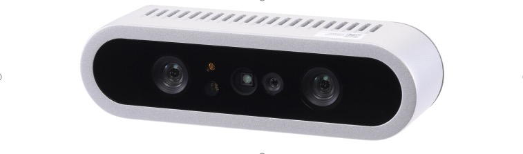{ width="800" }

Front view of the Gemini E camera from the datasheet.

## 1. What the Gemini E is good at

The Gemini E is a short-range RGB-D camera based on active stereo IR. It is a strong fit for:

- Indoor mobile robots
- Tabletop perception
- Manipulation and grasping pipelines
- Human detection and nearby obstacle sensing
- Robot docking and short-range scene understanding

It is not the right tool for every vision problem. The biggest constraints are:

- No built-in IMU
- USB 2.0 bandwidth
- Best depth range is close to the robot
- Active IR depth is much better indoors than in strong sunlight

If your stack depends on visual-inertial odometry, tight motion estimation, or robust outdoor operation in bright sun, plan for an external IMU and be realistic about depth performance.

## 2. Key hardware facts

The following values come from the Gemini E datasheet v1.1:

| Item | Value |
| --- | --- |
| Depth technology | Active Stereo IR |
| Depth field of view | 79 degrees horizontal x 62 degrees vertical |
| Color field of view | Up to 84.3 degrees horizontal x 53.6 degrees vertical |
| Depth range | 0.2 m to 2.5 m |
| Depth frame rates | Up to 30 fps |
| RGB frame rates | Up to 30 fps |
| RGB max resolution | 1920 x 1080 |
| Connection | USB 2.0 Type-C for power and data |
| Power | Average below 2.3 W, peak 5 W |
| IMU | Not available |
| Dimensions | 89.82 x 25.10 x 25.10 mm |
| Weight | 88.3 g |
| Mounting | Bottom M3, rear 2 x M3 |
| Operating environment | 10 C to 40 C, indoor or semi-outdoor |

### What these numbers mean for robot design

- `0.2 m to 2.5 m` means the Gemini E is a near-field sensor. Treat it as a local perception camera, not a long-range navigation lidar replacement.
- `USB 2.0` means bandwidth matters. High resolution RGB plus depth plus IR plus point cloud at the same time can overload weaker systems.
- `No IMU` means you should not expect the camera alone to support full VIO or stable motion estimation on a moving robot.
- `Wide FOV` is useful when the camera is mounted close to the work area or low on a mobile base.

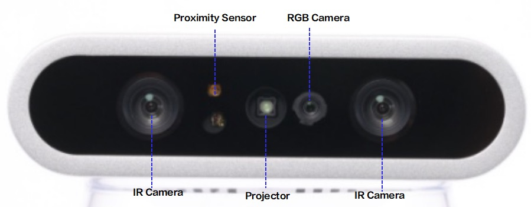{ width="800" }

Sensor layout from the datasheet showing the stereo IR cameras, projector, RGB camera, and proximity sensor.

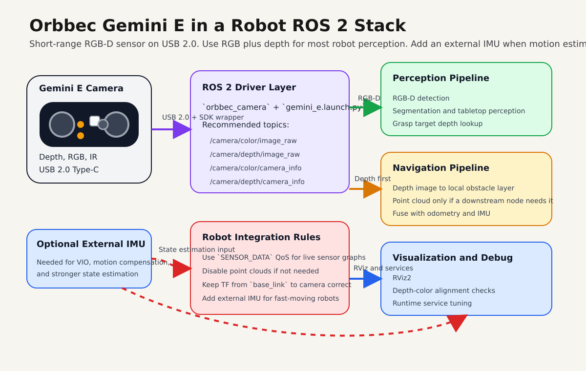{ width="1000" }

Recommended robotics integration path: use RGB plus depth as the default, keep point clouds optional, and add an external IMU when state estimation quality matters.

## 3. Best robotics use cases

### Mobile robot perception

Use the Gemini E for:

- Nearby obstacle perception
- Docking
- Doorway and corridor understanding
- Detecting low or irregular obstacles that 2D lidar can miss

Recommended working range:

- `0.25 m to 2.0 m` for practical onboard use

### Manipulation and pick-and-place

Use the Gemini E for:

- Object detection with aligned depth
- Tabletop segmentation
- Bin observation at short range
- Hand-eye setups on small robot arms

Recommended working range:

- `0.2 m to 1.2 m`

### Human-robot interaction

The wide field of view and short-range depth make it useful for:

- People detection near the robot
- Gesture-adjacent interaction
- Service robot front-facing perception

## 4. Where to mount it on a robot

Good mechanical integration matters as much as software.

- Mount the camera rigidly. Small vibrations become noisy depth edges.
- Keep the front glass clean. Fingerprints and dust reduce image quality.
- Avoid mounting directly beside motors, hot compute modules, or exhaust airflow.
- If you use an enclosure, leave space for cooling. The datasheet explicitly warns about heat buildup.
- Use a short, good-quality USB cable. The datasheet recommends a certified cable and a maximum length of about `1 m to 1.5 m`.
- For a mobile base, a slight downward tilt often works best so the depth image covers the floor in front of the robot.
- For manipulation, mount the camera so the main workspace sits comfortably inside the `0.2 m to 1.2 m` depth region.

### Practical mounting suggestions

- Front-facing mobile robot: mount above bumper height, angled down `10 to 20` degrees.
- Tabletop robot arm: mount above or beside the workspace with clear sight lines to the whole table.
- Docking robot: keep the camera centered to reduce calibration complexity.

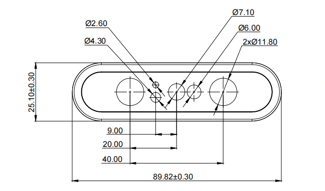{ width="850" }

Front mechanical dimensions from the datasheet.

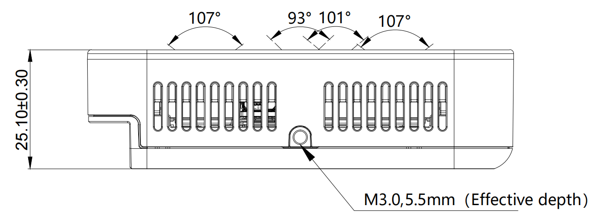{ width="850" }

Side view showing body dimensions and the M3 mounting point depth.

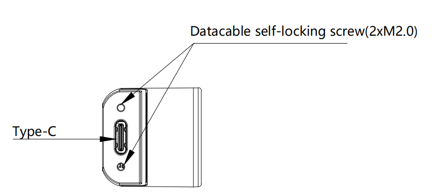{ width="650" }

Rear view showing the USB Type-C interface and rear fastener locations.

## 5. ROS 2 stack used in this workspace

This guide assumes the Orbbec ROS 2 wrapper is available in a workspace such as:

- `~/ros2_ws/src/OrbbecSDK_ROS2`

For Gemini E, the relevant launch file is:

- `orbbec_camera/launch/gemini_e.launch.py`

The local launch defaults are important:

| Stream | Default setting in `gemini_e.launch.py` |
| --- | --- |
| Color | `640x480 @ 30`, format `MJPG` |
| Depth | `640x480 @ 30`, format `Y11` |
| IR | `640x480 @ 30`, format `Y10` |
| Point cloud | Enabled |
| Colored point cloud | Disabled |
| Depth registration | Disabled |
| Soft filter | Enabled |
| Align mode | `HW` |

### Important implication

The default launch enables point clouds. For many robots, that is not the best default. If your downstream stack only needs depth images, disable point cloud generation to save CPU, bandwidth, and DDS load.

## 6. Install and build

If the package is already built in your workspace, skip to the next section.

```bash
cd ~/ros2_ws/src
git clone https://github.com/orbbec/OrbbecSDK_ROS2.git

sudo apt install libgflags-dev nlohmann-json3-dev \
  ros-$ROS_DISTRO-image-transport \
  ros-$ROS_DISTRO-image-transport-plugins \
  ros-$ROS_DISTRO-compressed-image-transport \
  ros-$ROS_DISTRO-image-publisher \
  ros-$ROS_DISTRO-camera-info-manager \
  ros-$ROS_DISTRO-diagnostic-updater \
  ros-$ROS_DISTRO-diagnostic-msgs \
  ros-$ROS_DISTRO-statistics-msgs \
  ros-$ROS_DISTRO-backward-ros \
  libdw-dev

cd ~/ros2_ws/src/OrbbecSDK_ROS2/orbbec_camera/scripts
sudo bash install_udev_rules.sh
sudo udevadm control --reload-rules
sudo udevadm trigger

cd ~/ros2_ws
colcon build --packages-select orbbec_camera orbbec_camera_msgs orbbec_description \
  --event-handlers console_direct+ \
  --cmake-args -DCMAKE_BUILD_TYPE=Release

source ~/ros2_ws/install/setup.bash
```

## 7. First bring-up

Start with the simplest reliable launch:

```bash
source ~/ros2_ws/install/setup.bash
ros2 launch orbbec_camera gemini_e.launch.py
```

In another terminal:

```bash
source ~/ros2_ws/install/setup.bash
ros2 topic list
ros2 service call /camera/get_device_info orbbec_camera_msgs/srv/GetDeviceInfo '{}'
ros2 service call /camera/get_sdk_version orbbec_camera_msgs/srv/GetString '{}'
```

To visualize:

```bash
source ~/ros2_ws/install/setup.bash
rviz2
```

Recommended first checks:

- Confirm `/camera/depth/image_raw` is publishing
- Confirm `/camera/color/image_raw` is publishing
- Confirm TF includes `camera_link` and optical frames
- Confirm frame rate is stable with `ros2 topic hz`

Example:

```bash
ros2 topic hz /camera/depth/image_raw
ros2 topic hz /camera/color/image_raw
```

### RViz examples

The following screenshots are representative RViz views from the local Orbbec ROS 2 wrapper documentation. They are useful as visual references when bringing the camera up for the first time.

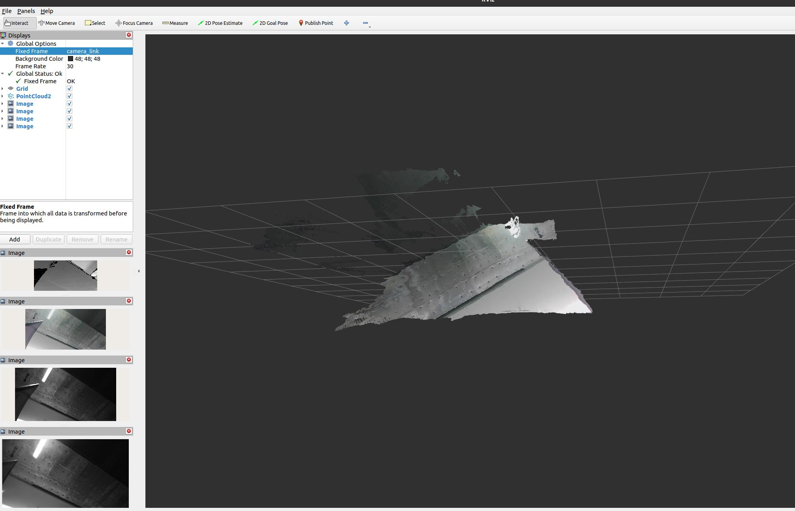{ width="1000" }

Depth and image streams visible in RViz. This is the kind of view you want during first bring-up when verifying that the camera is publishing stable image data.

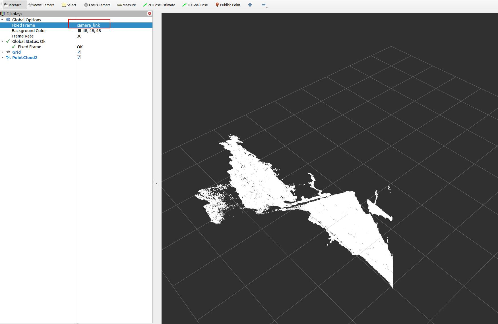{ width="1000" }

Depth point cloud view in RViz using `/camera/depth/points`. This is useful for validating geometry, floor visibility, and TF orientation.

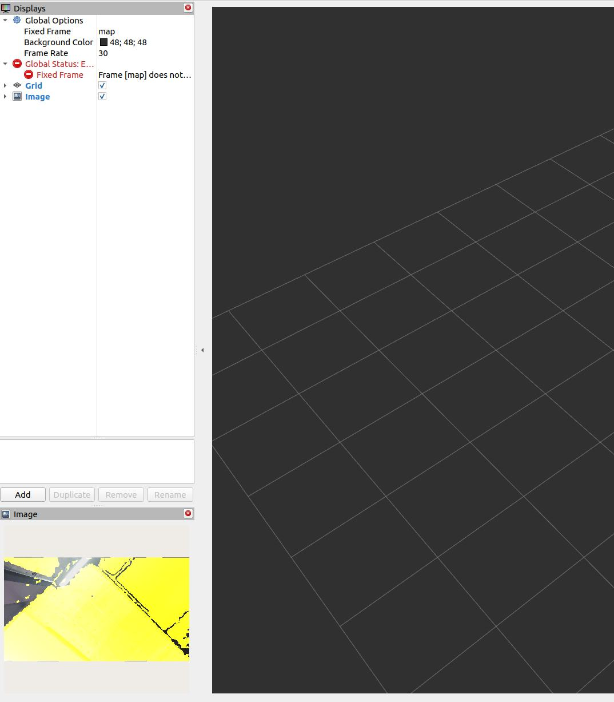{ width="760" }

Aligned RGB-D style output in RViz. This is the kind of image you should expect when `depth_registration:=true` is enabled and you are checking whether depth correctly overlays the color image.

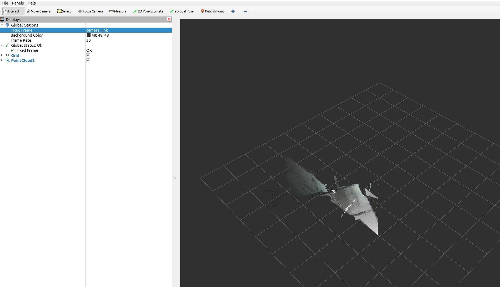{ width="1000" }

Colored point cloud in RViz using `/camera/depth_registered/points`. Use this when the downstream stack truly needs fused color and 3D structure.

## 8. Core topics you will actually use

| Topic | Use |
| --- | --- |
| `/camera/color/image_raw` | RGB image for detection or visualization |
| `/camera/depth/image_raw` | Raw depth image |
| `/camera/depth/points` | Point cloud from depth |
| `/camera/depth_registered/points` | Colored point cloud |
| `/camera/ir/image_raw` | IR image for debugging or custom vision |
| `/camera/color/camera_info` | Color intrinsics |
| `/camera/depth/camera_info` | Depth intrinsics |
| `/diagnostics` | Camera diagnostics |

If your perception stack does not consume point clouds directly, use depth images first. It is usually cheaper and easier to debug.

## 9. Recommended launch profiles for robot work

### Profile A: Low-latency mobile robot depth

Use this when the robot mainly needs near-field obstacle perception.

```bash
ros2 launch orbbec_camera gemini_e.launch.py \
  enable_color:=false \
  enable_ir:=false \
  enable_point_cloud:=false \
  enable_colored_point_cloud:=false \
  depth_registration:=false \
  depth_qos:=SENSOR_DATA \
  depth_camera_info_qos:=SENSOR_DATA
```

Why:

- Lowest bandwidth
- Lowest CPU load
- Simplest path into `depthimage_to_laserscan` or custom obstacle logic

### Profile B: RGB-D perception for detection and manipulation

Use this when you need color plus aligned depth for object detection, segmentation, or grasp planning.

```bash
ros2 launch orbbec_camera gemini_e.launch.py \
  enable_ir:=false \
  enable_point_cloud:=false \
  enable_colored_point_cloud:=false \
  depth_registration:=true \
  color_qos:=SENSOR_DATA \
  depth_qos:=SENSOR_DATA \
  color_camera_info_qos:=SENSOR_DATA \
  depth_camera_info_qos:=SENSOR_DATA
```

Why:

- Keeps RGB and depth available
- Depth registration makes RGB-depth fusion easier
- Avoids point cloud overhead unless the pipeline really needs it

### Profile C: Point cloud perception

Use this only if the downstream node truly needs 3D points.

```bash
ros2 launch orbbec_camera gemini_e.launch.py \
  enable_ir:=false \
  enable_point_cloud:=true \
  enable_colored_point_cloud:=true \
  depth_registration:=true \
  point_cloud_qos:=SENSOR_DATA \
  color_qos:=SENSOR_DATA \
  depth_qos:=SENSOR_DATA
```

Why:

- Gives you a colored point cloud
- Good for 3D inspection, segmentation, or local mapping

Tradeoff:

- Highest CPU, memory, and DDS load of the common profiles

### Profile D: Calibration and debugging

Use this when checking overlay quality, exposure, or stream issues.

```bash
ros2 launch orbbec_camera gemini_e.launch.py \
  depth_registration:=true \
  enable_d2c_viewer:=true \
  log_level:=debug
```

Why:

- Makes RGB-depth alignment errors obvious
- Debug logs help when the wrapper is unstable or the stream fails

## 10. Tuning rules that matter

### 10.1 Disable what you do not use

This is the single most useful rule.

- If you do not need point clouds, disable them.
- If you do not need IR, disable it.
- If you do not need RGB, disable it.
- If you do not need depth registration, leave it off.

### 10.2 Use `SENSOR_DATA` QoS for robot sensor pipelines

For local perception graphs, `SENSOR_DATA` is usually the right choice for:

- `color_qos`
- `depth_qos`
- `ir_qos`
- `point_cloud_qos`
- camera info QoS

This reduces lag compared with more reliable but slower defaults in many robotics workloads.

### 10.3 Respect USB 2.0 limits

The Gemini E is a USB 2.0 camera. That matters.

- Prefer `640x480` or `640x360` for reliable onboard processing
- Keep RGB in `MJPG` when possible
- Avoid enabling every stream at full rate on weak CPUs
- If performance becomes unstable, reduce streams before reducing code quality elsewhere

### 10.4 Use aligned depth only when needed

`depth_registration:=true` is useful for:

- RGB object detection with depth lookup
- colored point clouds
- grasp selection in image space

But it adds computation. Leave it off for pure navigation or pure depth pipelines.

### 10.5 Add an external IMU if the robot moves aggressively

The datasheet lists `IMU: N/A`.

If you need:

- motion compensation
- tilt-aware perception
- VIO
- visual-inertial SLAM

then use a separate IMU and fuse it with your robot state estimation stack.

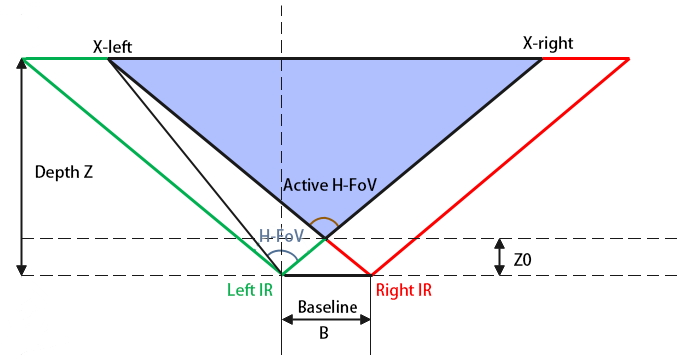{ width="760" }

Depth field-of-view geometry from the datasheet. This is useful when estimating how much floor, workspace, or docking target area is visible at a given mounting height and distance.

## 11. Recommended ROS 2 integration patterns

### Nav2 or collision avoidance

Good approaches:

- Convert depth image to a 2D scan using `depthimage_to_laserscan`
- Convert point cloud to scan using `pointcloud_to_laserscan`
- Fuse the camera with wheel odometry and an IMU in the navigation stack

Prefer depth image conversion first if you want the lightest pipeline.

### SLAM and localization

The Gemini E can support RGB-D or depth-assisted mapping, but do not assume the camera alone is enough for robust localization on a moving robot.

Recommended sensor set:

- Gemini E
- Wheel odometry
- External IMU

### Manipulation

For robot arms or tabletop robots:

- Enable color and depth
- Enable `depth_registration`
- Keep the workspace inside the short-range zone
- Use a fixed, calibrated transform from robot base or tool frame to camera frame

## 12. TF and frame setup

Do not leave TF as an afterthought.

The launch file already publishes a static transform from `base_link` to the camera link. You should set the mounting values correctly:

```bash
ros2 launch orbbec_camera gemini_e.launch.py \
  base_to_camera_x:=0.18 \
  base_to_camera_y:=0.0 \
  base_to_camera_z:=0.42 \
  base_to_camera_roll:=0.0 \
  base_to_camera_pitch:=-0.20 \
  base_to_camera_yaw:=3.141592653589793
```

Replace the values with your real mount geometry.

Bad TF is one of the most common reasons for:

- wrong point cloud orientation
- bad floor interpretation
- incorrect obstacle positions
- failed camera-arm coordination

## 13. Camera control services you should know

Useful runtime services exposed by the wrapper include:

- `/camera/get_device_info`
- `/camera/get_sdk_version`
- `/camera/get_color_exposure`
- `/camera/get_ir_exposure`
- `/camera/get_white_balance`
- `/camera/set_color_auto_exposure`
- `/camera/set_ir_auto_exposure`
- `/camera/set_laser_enable`
- `/camera/toggle_color`
- `/camera/toggle_depth`
- `/camera/toggle_ir`

Examples:

```bash
ros2 service call /camera/get_device_info orbbec_camera_msgs/srv/GetDeviceInfo '{}'
ros2 service call /camera/set_color_auto_exposure std_srvs/srv/SetBool '{data: false}'
ros2 service call /camera/set_laser_enable std_srvs/srv/SetBool '{data: true}'
```

These are useful when you are tuning the camera on a live robot without restarting the full stack.

## 14. Performance tuning on Linux

The local Orbbec wrapper documentation recommends DDS and USB tuning for large image streams.

### DDS guidance

For single-machine robotics setups, CycloneDDS is often a safer choice than untuned defaults.

Common local-only environment settings:

```bash
export ROS_DOMAIN_ID=42
export ROS_LOCALHOST_ONLY=1
export CYCLONEDDS_URI=file:///etc/cyclonedds/config.xml
```

Important:

- Use `ROS_LOCALHOST_ONLY=1` only when all nodes run on the same machine.
- If you need remote RViz, another onboard computer, or distributed robots, do not lock ROS traffic to localhost.

### USB buffer tuning

If you get stream dropouts, especially with multiple cameras or heavy traffic:

```bash
echo 128 | sudo tee /sys/module/usbcore/parameters/usbfs_memory_mb
```

### CPU and transport advice

- Build the wrapper in `Release`
- Prefer fewer streams over more compression tricks
- Avoid unnecessary RViz displays during benchmark runs
- If point clouds are only for logging, do not generate them during live operation

## 15. Failure modes and how to think about them

### No device detected

Check:

- USB cable quality
- udev rules
- power from host port
- reconnect the camera fully

The datasheet explicitly recommends unplugging and reconnecting if the camera stops responding.

### Frame drops or lag

Usually caused by one of these:

- Too many active streams
- Point cloud enabled when not needed
- Weak USB path or hub
- Untuned DDS
- RViz overloading the machine

Reduce complexity first. Do not start by blaming the algorithm stack.

### Poor outdoor or reflective-surface depth

This is expected behavior for many active IR depth systems.

- Use it primarily indoors
- Shield from direct sunlight where possible
- Expect weak returns on black, shiny, or transparent objects

### Bad perception while the robot is moving

The likely causes are:

- no IMU
- motion blur in RGB
- aggressive robot motion
- poor TF calibration

Do not try to "tune around" missing inertial information if the application fundamentally needs it.

## 16. A practical starting configuration

If you want one balanced starting point for most robots, use this:

```bash
ros2 launch orbbec_camera gemini_e.launch.py \
  enable_ir:=false \
  enable_point_cloud:=false \
  enable_colored_point_cloud:=false \
  depth_registration:=true \
  color_qos:=SENSOR_DATA \
  depth_qos:=SENSOR_DATA \
  color_camera_info_qos:=SENSOR_DATA \
  depth_camera_info_qos:=SENSOR_DATA
```

This gives:

- RGB plus depth
- simpler debugging than a full point cloud pipeline
- enough information for most perception tasks
- a manageable load on typical robot computers

## 17. Deployment checklist

Before declaring the camera "ready", verify all of the following:

- The camera is rigidly mounted
- The lens and cover glass are clean
- The TF from `base_link` to the camera is measured correctly
- Only required streams are enabled
- `ros2 topic hz` is stable at the expected frame rate
- CPU usage is acceptable during full robot operation
- Depth works across the actual working distance of the robot
- The robot stack is tested both stationary and moving
- You have an external IMU if the application needs one

## 18. References

- [Gemini E Datasheet v1.1 (PDF)](../files/orbbec-gemini-e-datasheet-v1.1.pdf)
- OrbbecSDK ROS 2 wrapper README and `gemini_e.launch.py` from the local ROS 2 workspace
- Orbbec developer portal: [https://orbbec3d.com/developers/](https://orbbec3d.com/developers/)
