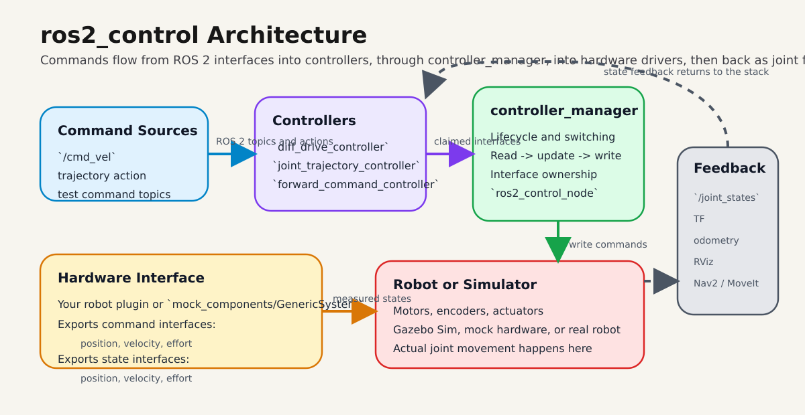
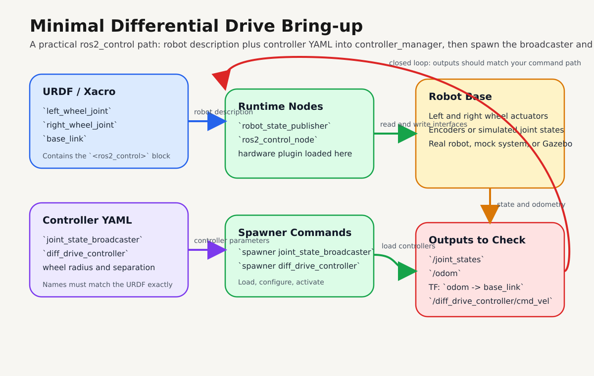
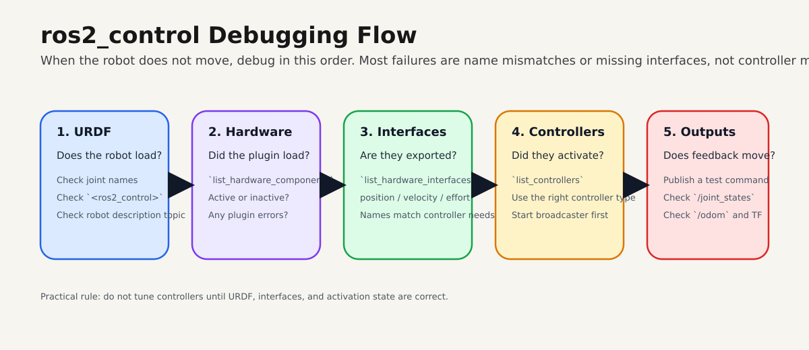

# ros2_control for ROS 2 Robots

Build a clean control pipeline for your robot using `ros2_control`, from command topics to hardware interfaces and feedback.

By the end of this page, you should be able to bring up a minimal differential-drive control stack and debug it quickly.

Official references:

- [ros2_control documentation](https://control.ros.org/)
- [Controller Manager docs](https://control.ros.org/jazzy/doc/ros2_control/controller_manager/doc/userdoc.html)
- [diff_drive_controller docs](https://control.ros.org/jazzy/doc/ros2_controllers/diff_drive_controller/doc/userdoc.html)
- [joint_trajectory_controller docs](https://control.ros.org/jazzy/doc/ros2_controllers/joint_trajectory_controller/doc/userdoc.html)

## Quick Start

Install core packages:

```bash
sudo apt update
sudo apt install ros-$ROS_DISTRO-ros2-control ros-$ROS_DISTRO-ros2-controllers
```

Bring up controllers:

```bash
ros2 run controller_manager spawner joint_state_broadcaster
ros2 run controller_manager spawner diff_drive_controller
```

Send a test command:

```bash
ros2 topic pub /diff_drive_controller/cmd_vel geometry_msgs/msg/TwistStamped \
  "{header: {frame_id: base_link}, twist: {linear: {x: 0.2}, angular: {z: 0.4}}}" -r 10
```

Expected result:

- `/joint_states` updates continuously
- `/odom` updates
- TF shows `odom -> base_link`

!!! tip
    If motion does not work, run `ros2 control list_hardware_interfaces` first. Most failures are interface mismatches.

## Prerequisites

| Item | Requirement |
| --- | --- |
| ROS 2 | A sourced ROS 2 environment (`$ROS_DISTRO`) |
| Robot description | URDF or xacro with valid joint names |
| Control config | Controller YAML with matching joint names |
| Runtime tools | `controller_manager` CLI available |

Optional for simulation:

```bash
sudo apt install ros-$ROS_DISTRO-gz-ros2-control
```

## Architecture

{ width="1100" }

High-level flow: ROS 2 commands go into controllers, `controller_manager` arbitrates interfaces, the hardware layer talks to motors or simulation, and feedback returns as joint states, odometry, and TF.

Typical data flow:

```text
cmd_vel / trajectory / command topic
        ->
controller
        ->
controller_manager
        ->
hardware interface
        ->
motors / actuators / simulator
        ->
joint state feedback
        ->
controllers + robot_state_publisher + RViz
```

## Core Concepts

`ros2_control` connects:

- controllers
- hardware drivers
- robot description
- command topics or actions
- joint feedback

Main runtime blocks:

- `controller_manager`: loads controllers, manages lifecycle, executes read-update-write loop
- hardware component: exports command and state interfaces
- controllers and broadcasters: consume interfaces and publish command/state outputs

Common controller packages:

| Package | Use |
| --- | --- |
| `joint_state_broadcaster` | publish joint states |
| `diff_drive_controller` | two-wheel mobile bases |
| `joint_trajectory_controller` | robot arms and multi-joint motion |
| `forward_command_controller` | direct command testing |

## Minimal Configuration

### 1) URDF `ros2_control` block

All joints used by controllers must exist in URDF and use exactly the same names.

```xml
<ros2_control name="DriveBaseSystem" type="system">
  <hardware>
    <plugin>mock_components/GenericSystem</plugin>
  </hardware>

  <joint name="left_wheel_joint">
    <command_interface name="velocity">
      <param name="min">-20.0</param>
      <param name="max">20.0</param>
    </command_interface>
    <state_interface name="position"/>
    <state_interface name="velocity"/>
  </joint>

  <joint name="right_wheel_joint">
    <command_interface name="velocity">
      <param name="min">-20.0</param>
      <param name="max">20.0</param>
    </command_interface>
    <state_interface name="position"/>
    <state_interface name="velocity"/>
  </joint>
</ros2_control>
```

Expected result:

- interfaces appear in `ros2 control list_hardware_interfaces`
- no missing-joint or interface-type errors on startup

### 2) Controller YAML

```yaml
controller_manager:
  ros__parameters:
    update_rate: 100

    joint_state_broadcaster:
      type: joint_state_broadcaster/JointStateBroadcaster

    diff_drive_controller:
      type: diff_drive_controller/DiffDriveController

diff_drive_controller:
  ros__parameters:
    left_wheel_names: ["left_wheel_joint"]
    right_wheel_names: ["right_wheel_joint"]

    wheel_separation: 0.36
    wheel_radius: 0.075

    publish_rate: 50.0
    base_frame_id: base_link
    odom_frame_id: odom
    use_stamped_vel: true
```

Expected result:

- controller types resolve correctly
- `joint_state_broadcaster` and `diff_drive_controller` can activate

!!! warning
    If `left_wheel_names` and `right_wheel_names` do not exactly match URDF joint names, the controller will not claim interfaces.

## Step-by-Step Bring-up

### 1) Start robot description and control node

Start `robot_state_publisher` with your URDF/xacro, then start `ros2_control_node` from `controller_manager`.

Expected result:

- hardware component is loaded
- no plugin initialization errors

### 2) Spawn controllers

```bash
ros2 run controller_manager spawner joint_state_broadcaster
ros2 run controller_manager spawner diff_drive_controller
```

Expected result:

- both controllers show as active in `ros2 control list_controllers`

### 3) Validate interfaces and runtime state

```bash
ros2 control list_hardware_components
ros2 control list_hardware_interfaces
ros2 control list_controllers
ros2 control list_controller_types
```

Expected result:

- hardware component present and active
- expected command interfaces available
- expected state interfaces available

### 4) Publish a drive command and verify feedback

```bash
ros2 topic pub /diff_drive_controller/cmd_vel geometry_msgs/msg/TwistStamped \
  "{header: {frame_id: base_link}, twist: {linear: {x: 0.2}, angular: {z: 0.4}}}" -r 10
```

Then verify:

- `/joint_states`
- `/odom`
- TF between `odom` and `base_link`
- wheel motion in RViz or simulator

{ width="1100" }

## Troubleshooting

| Symptom | Likely cause | Fix |
| --- | --- | --- |
| Controller fails to activate | Joint names mismatch between URDF and YAML | Match names exactly |
| No movement after command | Command interface type does not match controller expectation | Confirm `velocity`/`position` interface types |
| `/joint_states` missing | `joint_state_broadcaster` not started | Spawn broadcaster first |
| Robot description loads but control fails | Missing or incomplete `<ros2_control>` block | Add required interfaces per joint |
| Odometry is unstable or wrong | Bad wheel radius or wheel separation values | Calibrate and update YAML |
| Hardware appears loaded but inert | Component not active | Check lifecycle state and activation logs |

{ width="1100" }

!!! note
    Debug in this order: URDF, hardware load, interfaces, controller activation, then command/feedback topics.

## Real Robot vs Simulation

The controller layer can remain mostly the same while the hardware plugin changes.

Typical progression:

1. start with `mock_components/GenericSystem`
2. move to `gz_ros2_control` in simulation
3. replace with your real motor hardware plugin

This lets you validate control behavior before touching physical hardware.

## Next Steps

- write a custom hardware interface for your robot
- move manipulator projects to `joint_trajectory_controller`
- practice controller switching and lifecycle flows
- connect this stack to Nav2 or MoveIt after interfaces are stable

If you can activate `joint_state_broadcaster`, activate one motion controller, and verify interfaces from the CLI, your foundation is correct.
