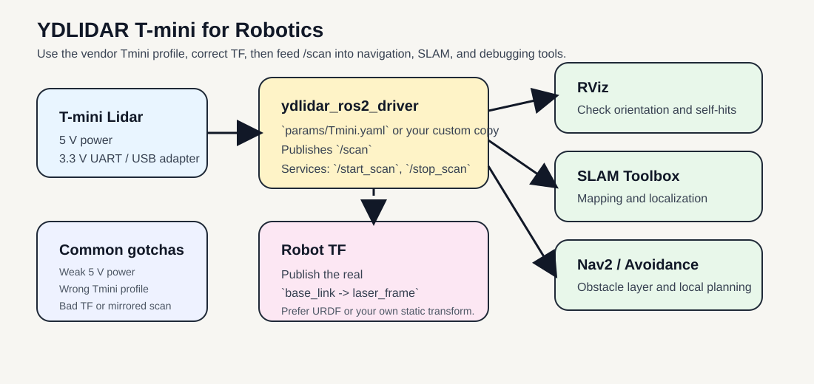
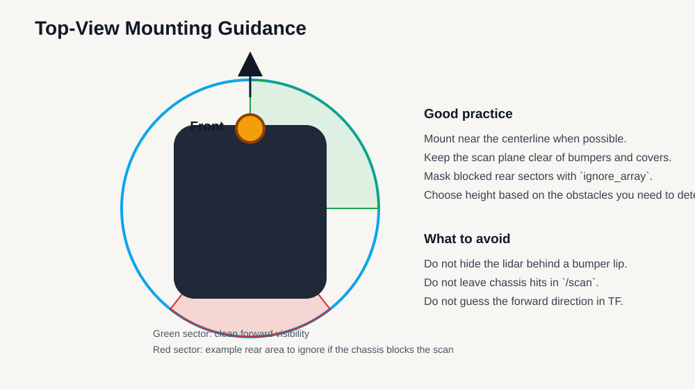

# YDLIDAR T-mini for Robotics

This guide is a practical training document for using the YDLIDAR T-mini family in robotics projects with ROS 2 and the official `ydlidar_ros2_driver`.

The goal is not just to make the lidar publish `/scan`, but to use it correctly on a robot: choose the right mount height, use the correct parameter file, avoid bad TF, and understand where a compact 2D lidar helps and where it does not.

This page targets the current `Tmini` ROS 2 profile used by YDLIDAR for `Tmini Pro` and `Tmini Plus`. The hardware numbers below use the current public `T-mini Plus` product page and datasheet because those are the public references that are easy to verify.

Official references:
- [YDLIDAR T-mini Plus product page](https://www.ydlidar.com/product/ydlidar-t-mini-plus)
- [YDLIDAR T-mini Plus datasheet (PDF)](https://www.ydlidar.com/Public/upload/files/2024-05-24/YDLIDAR%20T-mini%20Plus%20Data%20Sheet_V1.1%20%28240131%29.pdf)
- [YDLIDAR T-mini Plus user manual (PDF)](https://www.ydlidar.com/Public/upload/files/2024-05-24/YDLIDAR%20T-mini%20Plus%20User%20Manual_V1.0%20%28231222%29%20.pdf)
- [YDLIDAR ROS 2 driver](https://github.com/YDLIDAR/ydlidar_ros2_driver)
- [YDLIDAR SDK](https://github.com/YDLIDAR/YDLidar-SDK)

{ width="1000" }

Practical robot integration path: use the official `Tmini.yaml` profile, publish a correct `base_link -> laser_frame` transform, then feed `/scan` into RViz, SLAM, or navigation.

## 1. What the T-mini is good at

The YDLIDAR T-mini is a compact 360-degree 2D lidar for short-to-medium range robot perception. It is a strong fit for:

- Indoor mobile robots
- Education and ROS training
- Basic 2D SLAM
- Obstacle detection in one scan plane
- Docking and local navigation
- Small robots where size, weight, and power matter

It is not the right tool for every sensing problem. The main constraints are:

- It is a single 2D scan plane, not a 3D sensor
- It only sees obstacles that intersect its scan height
- A `6 to 12 Hz` scan rate is fine for small robots, but not ideal for aggressive high-speed motion
- Glass, transparent surfaces, table overhangs, and hanging obstacles still need other sensing
- Stable `5 V` power matters more than many people expect on SBC-based robots

If your robot must detect overhanging obstacles, open drawers, table edges above the lidar plane, or drop-offs below the plane, you need additional sensors such as bumpers, cliff sensors, or a depth camera.

## 2. Key hardware facts

The following values come from the current YDLIDAR T-mini Plus product page, datasheet, SDK dataset, and ROS 2 driver `Tmini.yaml` profile:

| Item | Value |
| --- | --- |
| Coverage | `360 degrees` |
| Ranging frequency | `4000 Hz` |
| Scan frequency | `6 to 12 Hz`, default `6 Hz` in datasheet |
| Practical ROS 2 frequency setting | `10.0` in `Tmini.yaml` |
| Range | `0.05 m to 12 m` at `80%` reflectivity |
| Dark target range | `0.05 m to 4 m` at `10%` reflectivity |
| Angle resolution | `0.54 degrees` |
| Systematic error | `+/- 20 mm` |
| Interface | `3.3 V UART`, `230400 bps`, GH1.25-4P |
| Supply voltage | `4.8 V to 5.2 V`, recommend `5 V 1 A` |
| Start-up current | typical `840 mA`, max `1000 mA` |
| Working current | typical `340 mA`, max `480 mA` |
| Lighting reference | up to `60000 Lux` |
| Operating temperature | `-10 C to 45 C` |
| Dimensions | `38.6 x 38.6 x 33.9 mm` |
| Weight | `45 g` |
| ROS 2 driver profile | `params/Tmini.yaml` |
| ROS 2 intensity setting | `intensity: true`, `intensity_bit: 8` |

### What these numbers mean for robot design

- `0.05 m` minimum range is good for close docking and small indoor robots.
- `12 m` maximum range sounds large, but real usable range depends heavily on reflectivity, angle, and environment.
- `6 to 12 Hz` means you should be realistic about robot speed. Small service robots are fine. Fast warehouse motion is less fine.
- `5 V` with startup current near `1 A` means weak USB ports can cause intermittent bring-up failures.
- `360 degrees` is useful, but only in one horizontal plane. If the plane misses an obstacle, the lidar misses the obstacle.

### Important operational note

There is a source mismatch worth knowing:

- The current public T-mini Plus product page and datasheet describe the product as ToF-based.
- The current YDLIDAR SDK and ROS 2 driver group `Tmini Pro` and `Tmini Plus` under `Tmini.yaml`, which uses `lidar_type: 1`.
- The SDK example `tmini_test.cpp` explicitly comments that `Tmini Pro` and `Tmini Plus` use the standard `Tmini` profile, while `Tmini Plus SH` is the separate special case.

For ROS 2 bring-up, use the vendor's current operational source of truth first:

- `params/Tmini.yaml` for `Tmini Pro` and `Tmini Plus`
- `params/Tmini-Plus-SH.yaml` only if you specifically have the `T-mini Plus SH` variant

## 3. Best robotics use cases

### Mobile robot navigation

Use the T-mini for:

- Local obstacle detection
- Costmap updates
- Corridor and doorway detection
- Docking and undocking
- Small indoor robot navigation

Recommended robot speed:

- Slow to moderate indoor motion

### Mapping and SLAM

Use the T-mini for:

- `slam_toolbox`
- Small lab maps
- Classroom demos
- Early-stage platform bring-up

### Education and teaching

The T-mini is a good teaching lidar because:

- The wiring is simple
- The ROS 2 topic model is simple
- `/scan` is easy to inspect in RViz
- The parameter file is small enough to understand fully

## 4. Where to mount it on a robot

Good mechanical integration matters as much as software.

- Mount the lidar rigidly.
- Keep the optical window clean.
- Do not bury the scan plane behind a bumper lip, plastic wall, or top cover.
- Use strain relief on the cable so vibration does not stress the connector.
- Choose the scan height based on the obstacles you actually care about.
- Keep the lidar clear of spinning wheels, dangling wires, and robot body panels that create self-hits.

### Practical mounting suggestions

- Small indoor base: mount near the front-center or geometric center, typically `10 cm to 25 cm` above the floor.
- Robot with a wide body: mount high enough to see chair legs and wall edges, but low enough to catch low obstacles.
- Education robot: front-center is easiest to reason about in RViz.
- If the robot body blocks part of the scan, keep the mount and use `ignore_array` to mask the blocked sectors.

{ width="900" }

Top-view mounting guidance: keep the scan plane clear, center the lidar when possible, and mask chassis-hit sectors in software instead of pretending they are valid obstacles.

## 5. ROS 2 stack used in this workspace

This guide assumes a workspace such as:

- `~/ydlidar_ros2_ws/src/YDLidar-SDK`
- `~/ydlidar_ros2_ws/src/ydlidar_ros2_driver`

The relevant ROS 2 files are:

- `ydlidar_ros2_driver/launch/ydlidar_launch.py`
- `ydlidar_ros2_driver/launch/ydlidar_launch_view.py`
- `ydlidar_ros2_driver/params/Tmini.yaml`

### Important implication

The official ROS 2 launch file includes a hard-coded static transform:

- `base_link -> laser_frame`
- translation `0 0 0.02`
- identity rotation quaternion `0 0 0 1`

That is acceptable for a test bench, but it is not a real robot calibration.

For actual robot work, the safest pattern is:

- run the driver node with your chosen `params_file`
- publish the correct transform from URDF or your own static transform publisher

### Another important implication

The user manual still shows ROS 1 commands like `roslaunch ... Tmini.launch`.

For current ROS 2 work:

- do not copy the old ROS 1 `Tmini.launch` workflow
- use `ydlidar_launch.py` or run `ydlidar_ros2_driver_node` directly

## 6. Install and build

If the SDK and driver are already built in your workspace, skip to the next section.

```bash
sudo apt install cmake pkg-config \
  ros-$ROS_DISTRO-tf2-ros \
  ros-$ROS_DISTRO-rviz2

mkdir -p ~/ydlidar_ros2_ws/src
cd ~/ydlidar_ros2_ws/src

git clone https://github.com/YDLIDAR/YDLidar-SDK.git
git clone -b humble https://github.com/YDLIDAR/ydlidar_ros2_driver.git

cd ~/ydlidar_ros2_ws/src/YDLidar-SDK
mkdir -p build
cd build
cmake ..
make
sudo make install

cd ~/ydlidar_ros2_ws
colcon build --symlink-install --cmake-args -DCMAKE_BUILD_TYPE=Release

source ~/ydlidar_ros2_ws/install/setup.bash
```

Optional serial alias setup from the official driver:

```bash
cd ~/ydlidar_ros2_ws
chmod 0777 src/ydlidar_ros2_driver/startup/*
sudo sh src/ydlidar_ros2_driver/startup/initenv.sh
```

After the alias script, unplug and reconnect the lidar.

## 7. Prepare a robot-specific parameter file

Do not edit the vendor default file in place if you can avoid it.

Create your own copy:

```bash
cp ~/ydlidar_ros2_ws/src/ydlidar_ros2_driver/params/Tmini.yaml \
  ~/ydlidar_ros2_ws/src/ydlidar_ros2_driver/params/Tmini_robot.yaml
```

Recommended starting content:

```yaml
ydlidar_ros2_driver_node:
  ros__parameters:
    port: /dev/ydlidar
    frame_id: laser_frame
    ignore_array: ""
    baudrate: 230400
    lidar_type: 1
    device_type: 0
    intensity: true
    intensity_bit: 8
    isSingleChannel: false
    frequency: 10.0
    sample_rate: 4
    abnormal_check_count: 4
    fixed_resolution: true
    reversion: true
    inverted: true
    auto_reconnect: true
    support_motor_dtr: false
    angle_max: 180.0
    angle_min: -180.0
    range_max: 12.0
    range_min: 0.03
    invalid_range_is_inf: false
    debug: false
```

Parameters you will most likely change:

| Parameter | Why it matters |
| --- | --- |
| `port` | `/dev/ttyUSB0` on one machine may be `/dev/ttyUSB1` on another |
| `frame_id` | Must match your TF tree |
| `ignore_array` | Removes chassis hits or blind sectors |
| `angle_min`, `angle_max` | Restricts the published scan sector |
| `range_min`, `range_max` | Clamps noise outside your useful range |
| `frequency` | Trades refresh rate against stability |
| `reversion`, `inverted` | Fixes reversed scan direction or mirrored maps |

## 8. First bring-up

### Option A: Quick bench test with the vendor launch

Use this when you just want to see data fast:

```bash
source ~/ydlidar_ros2_ws/install/setup.bash
ros2 launch ydlidar_ros2_driver ydlidar_launch_view.py \
  params_file:=~/ydlidar_ros2_ws/src/ydlidar_ros2_driver/params/Tmini_robot.yaml
```

This is convenient, but remember that the launch file also publishes a generic `base_link -> laser_frame` transform.

### Option B: Better robot bring-up

Use this when you want real robot TF, not the vendor placeholder:

```bash
source ~/ydlidar_ros2_ws/install/setup.bash
ros2 run ydlidar_ros2_driver ydlidar_ros2_driver_node \
  --ros-args --params-file ~/ydlidar_ros2_ws/src/ydlidar_ros2_driver/params/Tmini_robot.yaml
```

In another terminal, publish your real transform or use your URDF:

```bash
source ~/ydlidar_ros2_ws/install/setup.bash
ros2 run tf2_ros static_transform_publisher \
  0.0 0.0 0.12 0 0 0 1 base_link laser_frame
```

Replace the transform with your real mount geometry.

### First checks

```bash
ls /dev/ttyUSB* /dev/ydlidar 2>/dev/null
ros2 topic list
ros2 topic echo /scan --once
ros2 topic hz /scan
ros2 service list | rg scan
```

Recommended first checks:

- Confirm `/scan` is publishing
- Confirm RViz shows a stable ring of scan points
- Confirm TF contains `base_link` and `laser_frame`
- Confirm the scan direction matches reality when the robot rotates
- Confirm the robot body is not polluting the scan with self-hits

## 9. Core topics and services you will actually use

| Name | Type | Use |
| --- | --- | --- |
| `/scan` | `sensor_msgs/msg/LaserScan` | Main navigation and mapping topic |
| `/parameter_events` | `rcl_interfaces/msg/ParameterEvent` | Parameter updates and debugging |
| `/start_scan` | `std_srvs/srv/Empty` | Starts scanning |
| `/stop_scan` | `std_srvs/srv/Empty` | Stops scanning |

Examples:

```bash
ros2 service call /stop_scan std_srvs/srv/Empty '{}'
ros2 service call /start_scan std_srvs/srv/Empty '{}'
```

## 10. Recommended launch profiles for robot work

### Profile A: General indoor robot

Use this as the default for most small robots:

- `frequency: 10.0`
- full `-180 to 180` angle range
- `range_min: 0.03`
- `range_max: 12.0`
- `ignore_array: ""`

Why:

- Balanced refresh rate
- Full scan available for SLAM and navigation
- Minimal complexity

### Profile B: Front-focused navigation

Use this when the robot mainly cares about the front sector:

- `angle_min: -135.0`
- `angle_max: 135.0`

Why:

- Removes data your controller may not need
- Simplifies local obstacle reasoning on front-facing robots

### Profile C: Chassis-aware filtering

Use this when the robot sees its own body or a mast:

- leave full scan enabled
- set `ignore_array` to the blocked sectors

Example:

```yaml
ignore_array: "-180,-150,150,180"
```

Why:

- Keeps useful 360-degree geometry
- Removes fake obstacles caused by the robot itself

### Profile D: Mapping and debugging

Use this during setup and validation:

- `frequency: 10.0`
- full scan enabled
- intensity enabled
- RViz running
- robot stationary first, then moving

Why:

- Makes orientation and self-occlusion problems obvious

## 11. Tuning rules that matter

### 11.1 Use the right profile file first

Start from:

- `Tmini.yaml` for `Tmini Pro` and `Tmini Plus`
- `Tmini-Plus-SH.yaml` only for the `SH` variant

Do not guess across models.

### 11.2 Fix power before you blame ROS

If the lidar is unstable:

- check `5 V` supply quality
- avoid weak unpowered hubs
- avoid thin or poor-quality USB power paths
- use auxiliary power if your platform USB current is weak

Many "driver problems" are actually power problems.

### 11.3 Validate scan direction early

If the map looks mirrored or rotated:

- check `reversion`
- check `inverted`
- check the physical forward direction of the lidar
- check the `base_link -> laser_frame` transform

Do not try to tune SLAM before the scan orientation is correct.

### 11.4 Filter the robot body explicitly

If the robot sees itself:

- use `ignore_array`
- move the lidar
- change mount height
- improve cable routing

Do not leave self-hits in the scan and hope Nav2 will sort it out.

### 11.5 Use a realistic scan frequency

The public specs say `6 to 12 Hz`. The vendor ROS 2 profile uses `10.0`.

Recommended practice:

- start with `10.0`
- drop lower if stability is poor
- only push higher after the platform is already stable

### 11.6 Clamp range to your real task

If the robot only needs near-field navigation, it can be useful to set a smaller `range_max`.

Why:

- reduces the effect of distant clutter
- keeps attention on actionable obstacles

## 12. Recommended ROS 2 integration patterns

### Nav2 or local avoidance

Good uses of `/scan`:

- obstacle layer input
- local costmap updates
- emergency stop or slowdown logic

### SLAM Toolbox

Good for:

- indoor lab maps
- classroom demos
- compact service robots

### Multi-sensor fusion

A strong low-cost combination is:

- T-mini for planar obstacle detection
- wheel odometry
- IMU
- optional depth camera for non-planar obstacles

This is a more honest robot stack than expecting a single 2D lidar to solve every perception problem.

## 13. TF and frame setup

Do not leave TF as an afterthought.

Use a frame strategy such as:

- `base_link`
- `laser_frame`

Recommended rules:

- measure the mount position instead of eyeballing it
- keep the forward direction consistent with the robot URDF
- use URDF plus `robot_state_publisher` when possible
- if you use a static publisher, document the numbers clearly

Bad TF is a common cause of:

- rotated maps
- mirrored scans
- bad obstacle positions
- confusing RViz views

## 14. Failure modes and how to think about them

### No device detected

Check:

- `/dev/ttyUSB0` versus `/dev/ydlidar`
- cable and adapter board
- USB permissions
- whether the alias script was run
- whether the lidar was replugged after the alias script

### The node starts but `/scan` is empty

Usually one of these:

- wrong `port`
- wrong model parameter file
- unstable power
- SDK not installed correctly

### Map is mirrored or rotated

Usually caused by:

- wrong `reversion`
- wrong `inverted`
- wrong physical forward direction
- wrong TF

### Robot detects itself

Usually caused by:

- lidar mounted behind the bumper edge
- body panels inside the scan plane
- cables or posts crossing the scan plane
- no `ignore_array` mask

### Scan quality is poor on specific objects

This can happen with:

- glass
- transparent plastics
- shiny surfaces
- geometry above or below the scan plane

That is a sensing limitation, not always a software bug.

## 15. A practical starting configuration

If you want one balanced starting point for most indoor robots:

- use `Tmini.yaml` as the base
- set `port` to `/dev/ydlidar` if you use the alias script
- keep `frequency: 10.0`
- keep full `-180 to 180` scan range
- set a correct `base_link -> laser_frame` transform
- add `ignore_array` only if the robot body blocks part of the scan

Bring-up commands:

```bash
source ~/ydlidar_ros2_ws/install/setup.bash
ros2 run ydlidar_ros2_driver ydlidar_ros2_driver_node \
  --ros-args --params-file ~/ydlidar_ros2_ws/src/ydlidar_ros2_driver/params/Tmini_robot.yaml
```

```bash
source ~/ydlidar_ros2_ws/install/setup.bash
ros2 run tf2_ros static_transform_publisher \
  0.0 0.0 0.12 0 0 0 1 base_link laser_frame
```

This gives you:

- a clean `/scan` topic
- real TF instead of the vendor placeholder
- a setup that is easy to debug in RViz

## 16. Deployment checklist

Before declaring the lidar ready, verify all of the following:

- The lidar has stable `5 V` power
- The optical window is clean
- The lidar is rigidly mounted
- The scan plane intersects the obstacles you care about
- The correct `Tmini` parameter file is in use
- `/scan` is stable at the expected rate
- TF from `base_link` to `laser_frame` is correct
- The robot does not see its own body as obstacles
- Nav or SLAM is tested both stationary and moving
- Another sensor covers what a 2D scan plane cannot see

## 17. References

- YDLIDAR product page: [https://www.ydlidar.com/product/ydlidar-t-mini-plus](https://www.ydlidar.com/product/ydlidar-t-mini-plus)
- T-mini Plus datasheet: [https://www.ydlidar.com/Public/upload/files/2024-05-24/YDLIDAR%20T-mini%20Plus%20Data%20Sheet_V1.1%20%28240131%29.pdf](https://www.ydlidar.com/Public/upload/files/2024-05-24/YDLIDAR%20T-mini%20Plus%20Data%20Sheet_V1.1%20%28240131%29.pdf)
- T-mini Plus user manual: [https://www.ydlidar.com/Public/upload/files/2024-05-24/YDLIDAR%20T-mini%20Plus%20User%20Manual_V1.0%20%28231222%29%20.pdf](https://www.ydlidar.com/Public/upload/files/2024-05-24/YDLIDAR%20T-mini%20Plus%20User%20Manual_V1.0%20%28231222%29%20.pdf)
- ROS 2 driver: [https://github.com/YDLIDAR/ydlidar_ros2_driver](https://github.com/YDLIDAR/ydlidar_ros2_driver)
- SDK: [https://github.com/YDLIDAR/YDLidar-SDK](https://github.com/YDLIDAR/YDLidar-SDK)
